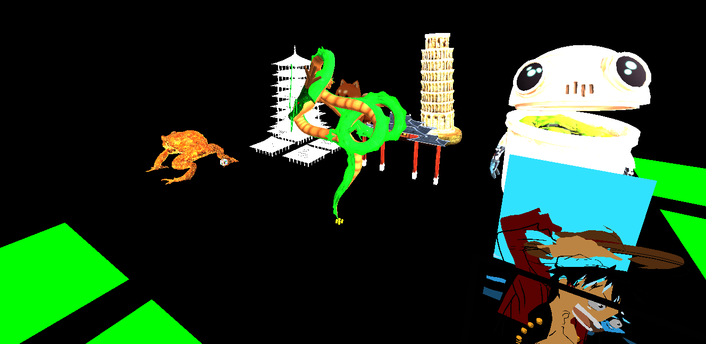

## Domain: buildverse.live
(currently down)

# BuildVerse
BuildVerse is a 3D sandbox platform that allows players to add their creations into a shared virtual world. Players can claim a plot of land and make changes to it using a 3D modeling software of their choice, then submit this plot to be displayed among other players' creations.

## Core Features

- Users can create a BuildVerse account to participate in 3D public worlds.
- Users can select a plot of land from a public world to add their creations.
- Users can modify the land plot by adding their own 3D models and environments.
- Users can view individual plots of land or view a subsection of the public 3D world
- Users can add reactions and comments to other users’ land plots.
- Users will be notified when their creation is rated by other users

## Built with ...

#### Core technologies
- Angular
- MongoDB
- Redis
- SharedDB
- Three.js
- Socket.io

#### External Services
- Auth0
- SendGrid

#### Deployment
- Docker
- Nginx
- Let's Encrypt

## Our team
- <a href="https://github.com/JuefeiLu" target="_blank" rel="noopener noreferrer">Juefei Lu</a>
- <a href="https://github.com/youngjaeheo2002" target="_blank" rel="noopener noreferrer">Youngjae Heo</a>
- <a href="https://github.com/Onotate" target="_blank" rel="noopener noreferrer">John Pham</a>

## Our Milestones

**Alpha**:

- Account creation and Authentication.
- Users can select a land plot from a pool of predefined plots in a public 3D world.
- Users can make edits to their chosen land plot and submit their changes.

**Beta**:

- Users can view their and others' land plots individually or in a subsection of the 3D world.
- Ratings and comments implementation.

**Final**:

- Live notification and email notification
